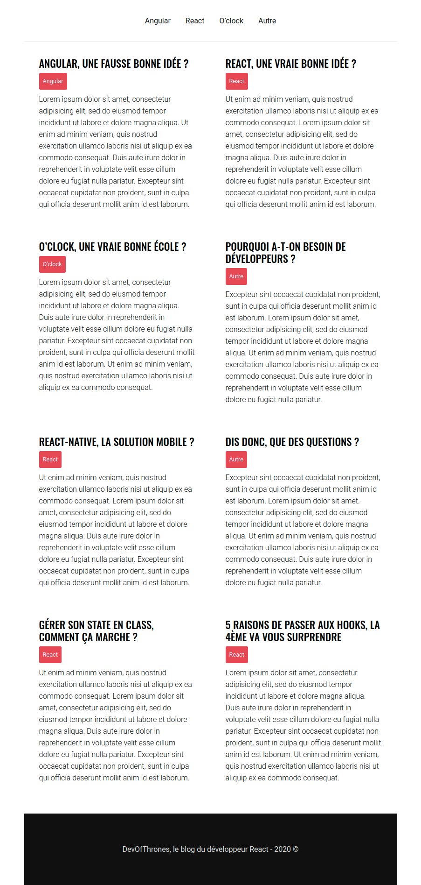

# Challenge : Blog React

## Instructions

* Le but est de **modulariser** le code au maximum via des composants React, mais aussi en créant des fichiers de styles séparés.
* Si possible, les datas doivent provenir du composant racine. Vous pouvez très bien faire des composants « impurs » au départ pour commencer…

## Charte graphique

### Google Font

Oswald 500 (titre), Roboto 400 (par défaut) et 300 (résumés des articles)

### Couleurs

* Bordure du header : #ddd
* Couleur des liens du header 
  - #101010
  - hover : #e52354
* Background d'un post au hover : #f0f0f0
* Textes : #000
* Tag Category
  - Arrière plan : #e52354
  - Couleur #fff
* Content #777
* Footer
  - Arrière plan : #101010
  - Couleur #ddd
